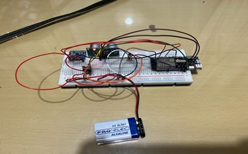
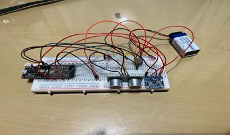

# **Design and Development of a Wireless Sensor Network (WSN)**
---

# **Disclaimer:**

**This project has been developed as part of the coursework for the module Sensors and Networks at the University of Greenwich during Year II of Computer Engineering BEng (Hons) (Academic Year 2022/23)** 

**All credits must be given to the creators and the University of Greenwich.**

- Wireless Sensor Network

  

- Website 

## Introduction

This project focuses on the design and implementation of a wireless sensor network (WSN) capable of collecting, processing, and transmitting environmental data. The system monitors parameters such as temperature, distance, and position. The main objective was to build a reliable WSN that can gather sensor data and display it on a web-based platform. The project involved familiarizing with components, testing their functionality in an IDE, developing a monitoring webpage, and enabling wireless communication. Repeated testing and debugging were performed to resolve sensor integration and wireless connectivity issues.

## Background

### Wireless Sensor Network Overview

Wireless Sensor Networks (WSNs) consist of interconnected sensor nodes capable of sensing, processing, and communicating data from their environment. WSNs are widely used in various industries for monitoring applications.

The goal of this project was to create a WSN node to gather data from accelerometers, ultrasonic sensors, and temperature sensors, and transfer the data to a webpage. The process involved understanding the components, testing them, developing a website for monitoring, and using wireless communication to link the WSN to external devices.

## Design & Implementation

### Components

- **Lolin D32 Pro** (Microcontroller)
- **SRF05** (Ultrasonic Sensor)
- **LM35** (Temperature Sensor)
- **LSM303DLHC** (Accelerometer)
- **9V Battery** (Power source)
- **L78M05CV** (Power Regulator)
- **Breadboard** (For component connections)

The development process followed these stages:

### Stage I: Familiarization of Components
- Researched and gathered datasheets for all components.
- Tested components individually using a breadboard and Lolin D32 Pro.
- Integrated components according to datasheets and block diagram specifications.

### Stage II: Examination Using Cable & IDE
- Tested the WSN using Arduino IDE and established communication with sensors.
- Libraries used include `Wire.h`, `Adafruit_Sensor.h`, and `Adafruit_LSM303_U.h`.
- Conducted detailed sensor data testing and calibration.

### Stage III: Building a Monitoring Platform
- Developed an HTML webpage to display sensor data (temperature, distance, and acceleration) using a table format.
- Styled the webpage using CSS for clear presentation of data.

### Stage IV: Wireless Communication Implementation
- Utilized ESP32’s Wi-Fi capability to create an access point for wireless communication.
- Set up a web server to handle sensor data retrieval and dynamic updates to the webpage.

## Work Carried Out

1. **Component Familiarization:** Researched datasheets and tested components on a breadboard.
2. **Functionality Testing:** Ensured sensor communication via Arduino IDE.
3. **Monitoring Platform:** Developed an HTML webpage to display sensor data.
4. **Wireless Communication:** Established wireless data transfer using ESP32.

## Conclusion

This project successfully developed a wireless sensor network (WSN) for monitoring environmental data in real-time and displaying it on a web-based platform. Despite challenges such as voltage mismatches and sensor accuracy issues, thorough testing and research enabled us to achieve the desired outcomes. Future improvements could focus on enhancing data accuracy and expanding the system's functionality.

---
